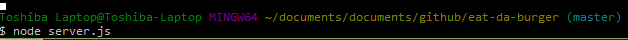
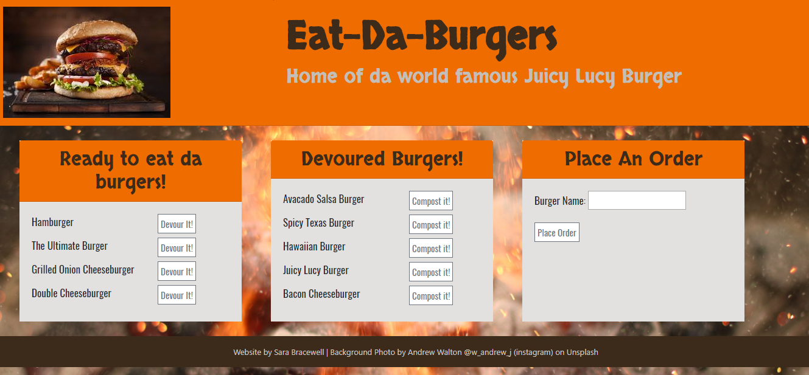
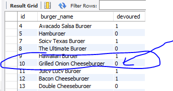
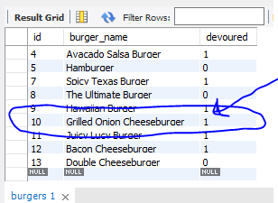
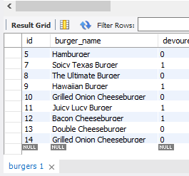
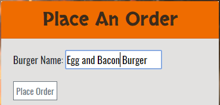
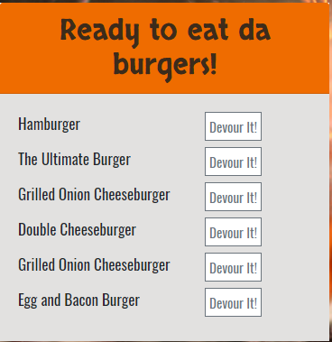
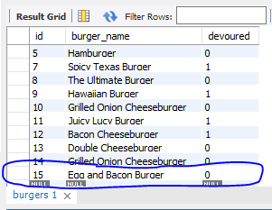

Burger 2: The Sequel


Overview

This homework assignment is optional. 

In this assignment, you're going to Sequelize the Burger app you made last week. We've split this exercise into three different tiers, all with different tasks and expectations. Finish whichever tier will provide you with the most reasonable challenge.


Before you Begin


Create a new folder called sequelizedBurger

Copy the contents of your completed assignment from last week.


Remove the older git connection with rm -R .git. 
Then connect this folder with a new github repo.


Run sequelize init to create the necessary files.
Note: If for any reason you don't have a finished assignment for last week, no problem. Message the instructor, who will provide you will a skeleton file to work of for this week.


Instructions

Put in your best efforts to complete one of the three available challenge tiers. Remember to deploy your assignment to Heroku once complete.


Tier 1: Sequelized! (Basic to Moderate)


Remove all references to your vanilla MySQL queries and replace them with Sequelize queries.

That means:


Replacing your MySQL Burger model with a Sequelized equivalent.
Don't forget to edit the model and initial migration file to make the burger's devoured field carry a default value of false -- otherwise you might encounter bugs.


There's no option to include that default in the command line, so you'll need to open up your editor to make this change. 


Don't forget to sync the models!
Edit your new config.json file to include your database configurations. Place your JawsDB details in the production property of your json file; the details of your local database go in the developer property.
Remove your old ORM file, as well as any references to it in burgers_controller.js. Replace those references with Sequelize's ORM methods.


When you finish, your site should function just like your last one:
 


Tier 2: Customer Associations (Challenge)


Add in a Customer association to the project. This will involve creating at least one new Customer model and connecting it with your Burger model.
What kind of association you would like to use is up to you. Does a Customer have one Burger? Many Burgers?

For example, you could make a site that logs the name of which Customer ate which Burger, where each Customer only gets one Burger. If you can't think of another type of association, try this one!


If you do go select this tier, you must edit the handlebars files and CSS stylesheets to implement some sort of additional feature to the site. We don't want you to just connect two models and submit your project. Make your site do something relevant to this association.


Bonus! (Challenge)


Add validations to your models where:


A burger's name cannot be null
A burger's devoured status is false by default
A Customer's name cannot be null


Order the Burgers you send back to the user in alphabetical order using the Sequelize "order" option.


Minimum Requirements

Attempt to complete homework assignment as described in instructions. If unable to complete certain portions, please pseudocode these portions to describe what remains to be completed.


Hosting on Heroku

Now that we have a backend to our applications, we use Heroku for hosting. Please note that while Heroku is free, it will request credit card information if you have more than 5 applications at a time or are adding a database. 

Please see Heroku’s Account Verification Information for more details. 


Create a README.md

Add a README.md to your repository describing the project. Here are some resources for creating your README.md. Here are some resources to help you along the way:


About READMEs
Mastering Markdown


Add To Your Portfolio

After completing the homework please add the piece to your portfolio. Make sure to add a link to your updated portfolio in the comments section of your homework so the TAs can easily ensure you completed this step when they are grading the assignment. To receive an 'A' on any assignment, you must link to it from your portfolio.


One More Thing

If you have any questions about this project or the material we have covered, please post them in the community channels in slack so that your fellow developers can help you! If you're still having trouble, you can come to office hours for assistance from your instructor and TAs.

Good Luck!

# Node Express Handlebars

This app is all about eating burgers, yes, that's right! You'll create a burger logger with MySQL, Node, Express, Handlebars and a homemade ORM (yum!). Be sure to follow the MVC design pattern; use Node and MySQL to query and route data in your app, and Handlebars to generate your HTML.
* Eat-Da-Burger! is a restaurant app that lets users input the names of burgers they'd like to eat.
```

* Whenever a user submits a burger's name, your app will display the burger on the
 left side of the page -- waiting to be devoured.

* Each burger in the waiting area also has a `Devour it!` button. When the user
 clicks it, the burger will move to the right side of the page.

* Your app will store every burger in a database, whether devoured or not.

* [Check out this video of the app for a run-through of how it works](burger_demo.mp4).

```

## Getting Started

These instructions will get you a copy of the project up and running on your local machine for development and testing purposes. See deployment for notes on how to deploy the project on a live system.

### Prerequisites

This app requires a number of programs:
* [Node.js](https://nodejs.org/en/)
* [MySQL Workbench](https://www.mysql.com/products/workbench/)
* NPM Packages: 
	* [Express](https://www.npmjs.com/package/express)
	* [Express-Handlers](https://www.npmjs.com/package/express-handlebars)
	* [Body-Parser](https://www.npmjs.com/package/body-parser)
	* [MySQL](https://www.npmjs.com/package/mysql)
	* [dotenv](https://www.npmjs.com/package/dotenv)


#### Directory structure

All the recommended files and directories from the steps above should look like the following structure:

```
Eat-Da-Burger
│
├── config
│   ├── connection.js
│   └── orm.js
│ 
├── controllers
│   └── burgers_controller.js
│
├── db
│   ├── schema.sql
│   └── seeds.sql
│
├── models
│   └── burger.js
│ 
├── node_modules
│ 
├── package.json
│ 
├──.env
│
├── public
│   ├── assets
│   │	├── css
│   │   │   └── burger_style.css
│   │   ├── img
│   │   │   └── burger.png
│   │   └── js
│   │   	 └── burgers.js
│   │
│   └── test.html
│
├── server.js
│
└── views
    ├── index.handlebars
    │
    ├── layouts
    │   └── main.handlebars
    │
    └── partials
    	└── burgers
		└── burgers.js
```

## Instructions on setting up and running this app on your computer

#### App Setup

1. Fork a copy to your Github repo and clone it to your computer.

1. Got to your Git Bash and got to into the folder called Eat-Da-Burger.

1. To get all the npm packages required to run this app type into the command line `npm install`

1. Create a server.js file.


#### Database Setup

1. On your computer, open MySQL Workbench and login to a local server you have set up. 

__One option for executing the database code required to run the app is:__

1. Open a new SQL tab for executing queries.

1. Then go back to your chosen text editor (I suggest either Visual Studio or Sublime Text) and open your `Eat-Da-Burger` folder.

1. Inside the `Eat-Da-Burger` folder you will find a folder named `db`.

1. In the `db` folder, open the file named `schema.sql`. Copy the code in the file and paste it to the new SQL tab you opened in MySQL Workbench.

1. Go back to the `db` folder in you text editor and open the `seeds.sql` file and copy the code and paste it into the open tab in MySQL Workbench and execute the code.


__The other option for running the MySQL code is to:__


1. Run the `schema.sql` and `seeds.sql` files into the mysql server from the command line

1. Now you're going to run these SQL files.

1. Make sure you're in the `db` folder of your app.

1. Start MySQL command line tool and login: `mysql -u root -p`.

1. With the `mysql>` command line tool running, enter the command `source schema.sql`. This will run your schema file and all of the queries in it -- in other words, you'll be creating your database.

1. Now insert the entries you defined in `seeds.sql` by running the file: `source seeds.sql`.

1. Close out of the MySQL command line tool: `exit`.


#### .env file Setup

1. In the command line of the main folder of `Eat-Da-Burger` type `touch .env` 

1. In your text editor, open the `.env` file and type `MYSQL_PASSWORD = "enter your MySQL password here"`

1. Save the file


#### Open App in Browser

1. In the command line go into main folder of `Eat-Da-Burger`

1. Type `node server.js` end hit enter



1. Go to your browser and open a new tab and type `localhost:3000` then hit enter


As you can see from the image there are 3 columns: Ready to Eat da Burger, Devoured Burgers, Order da Burger 


#### Using the App

**Eat da Burger Option**

* In the `Ready to Eat da Burger` column, if you hit the `Devour It !` button it will change the devour status to true in MySQL, which will place the burger in the Devoured Burgers column. This burger will still be listed in MySQL. For example, if you choose to devour the Grilled Onion Cheeseburger, this is what it looks like in MySQL. Note that the Devour number is a 0 which equals true:

	

* If then I hit the button to devour it, you can see that the Devour number changes to false, which in binary code is 1:

	

**Reorder da Burger**

* You can choose to reorder a burger that was eaten if it sounds good to you. Just hit the `Reoder It` button under Devoured Burgers and it will show as Ready to Eat again.

**Order da Burger**

* You can add or order a burger by going to that column and typing in the name of your favorite buger then hit order. The burger will be added to the Eat da Burger column since the default setting on adding a burger is to set the Devour to true, which places it in that column.

* Here is MySQL before I added the burger:
	
	

* Here I am adding a Egg and Bacon Burger:

	

* This shows the addition to the Ready to Eat da Burger column:

	

* And lastly that it was added to MySQL:

	 


## Deployment

This application is delployed at [https://still-sea-48695.herokuapp.com/](https://still-sea-48695.herokuapp.com/)


## Author

* [Sara Bracewell](https://github.com/2crazyflowers)

## Acknowledgments

* A big thanks to Sunday coding crew, especially Phil Stubbs who is always, without even trying to, pushing me to do more and better.
* Background Photo by Andrew Walton @w_andrew_j (instagram) on Unsplash

## Issues

* One issue that I have noticed is that there is a lag in time between making changes on the browser and those changes being updated to the browser and MySQL. 

Burger 2: The Sequel


Overview

This homework assignment is optional. 

In this assignment, you're going to Sequelize the Burger app you made last week. We've split this exercise into three different tiers, all with different tasks and expectations. Finish whichever tier will provide you with the most reasonable challenge.


Before you Begin


Create a new folder called sequelizedBurger

Copy the contents of your completed assignment from last week.


Remove the older git connection with rm -R .git. 
Then connect this folder with a new github repo.


Run sequelize init to create the necessary files.
Note: If for any reason you don't have a finished assignment for last week, no problem. Message the instructor, who will provide you will a skeleton file to work of for this week.


Instructions

Put in your best efforts to complete one of the three available challenge tiers. Remember to deploy your assignment to Heroku once complete.


Tier 1: Sequelized! (Basic to Moderate)


Remove all references to your vanilla MySQL queries and replace them with Sequelize queries.

That means:


Replacing your MySQL Burger model with a Sequelized equivalent.
Don't forget to edit the model and initial migration file to make the burger's devoured field carry a default value of false -- otherwise you might encounter bugs.


There's no option to include that default in the command line, so you'll need to open up your editor to make this change. 


Don't forget to sync the models!
Edit your new config.json file to include your database configurations. Place your JawsDB details in the production property of your json file; the details of your local database go in the developer property.
Remove your old ORM file, as well as any references to it in burgers_controller.js. Replace those references with Sequelize's ORM methods.


When you finish, your site should function just like your last one:
 


Tier 2: Customer Associations (Challenge)


Add in a Customer association to the project. This will involve creating at least one new Customer model and connecting it with your Burger model.
What kind of association you would like to use is up to you. Does a Customer have one Burger? Many Burgers?

For example, you could make a site that logs the name of which Customer ate which Burger, where each Customer only gets one Burger. If you can't think of another type of association, try this one!


If you do go select this tier, you must edit the handlebars files and CSS stylesheets to implement some sort of additional feature to the site. We don't want you to just connect two models and submit your project. Make your site do something relevant to this association.


Bonus! (Challenge)


Add validations to your models where:


A burger's name cannot be null
A burger's devoured status is false by default
A Customer's name cannot be null


Order the Burgers you send back to the user in alphabetical order using the Sequelize "order" option.


Minimum Requirements

Attempt to complete homework assignment as described in instructions. If unable to complete certain portions, please pseudocode these portions to describe what remains to be completed.


Hosting on Heroku

Now that we have a backend to our applications, we use Heroku for hosting. Please note that while Heroku is free, it will request credit card information if you have more than 5 applications at a time or are adding a database. 

Please see Heroku’s Account Verification Information for more details. 


Create a README.md

Add a README.md to your repository describing the project. Here are some resources for creating your README.md. Here are some resources to help you along the way:


About READMEs
Mastering Markdown


Add To Your Portfolio

After completing the homework please add the piece to your portfolio. Make sure to add a link to your updated portfolio in the comments section of your homework so the TAs can easily ensure you completed this step when they are grading the assignment. To receive an 'A' on any assignment, you must link to it from your portfolio.


One More Thing

If you have any questions about this project or the material we have covered, please post them in the community channels in slack so that your fellow developers can help you! If you're still having trouble, you can come to office hours for assistance from your instructor and TAs.

Good Luck!